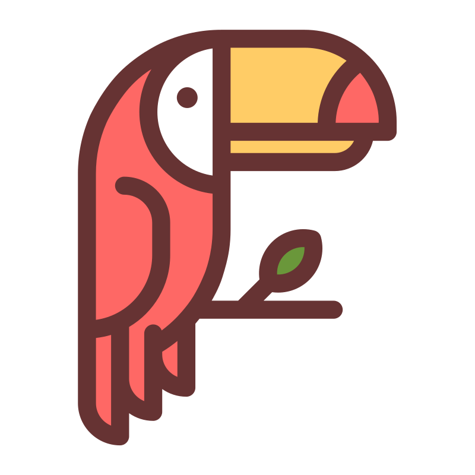

# MotsFlex

<a href="https://motsflex.com">
  
</a>

**Generateur de mots fléchés. Crosswords generator. Generator de Crucigramas.**

## Use MotsFlex

MotsFlex is up and running at [https://motsflex.com](https://motsflex.com). 

# [Documentation](https://leo-nicolle.github.io/mots-fleches/)

This documentation is for developers. For user documentation please see the link above. 
## How to contribute ?

Clone the repository (or fork it)
```sh
git@github.com:Leo-Nicolle/mots-fleches.git
```

**install:**
```sh
cd mots-fleches
npm i
```
** run client:**
```sh
cd mots-fleches/client
npm i
npm run dev
```
Make a PR, I would be happy :).

## SEO & prerendering

The public pages (`/` and `/changelog`) are pre-rendered to static HTML at build
time (see `scripts/prerender.mjs`) so search engines can index them without
running JavaScript. This uses a headless Chromium via Playwright.

**One-time setup** — install the browser into the workspace:

```sh
PLAYWRIGHT_BROWSERS_PATH=$PWD/.pw-browsers npx playwright install chromium
```

`npm run build` now runs `vite build` then `npm run prerender` automatically.

**SEO images** (`og-image.png`, `apple-touch-icon.png`) are generated from
`client/public/icon.svg` — regenerate them after changing the icon:

```sh
npm run generate:seo-images
```

The SEO metadata lives in `client/index.html` (defaults) and
`client/src/js/seo.ts` (per-route titles/descriptions), and the crawl files are
in `client/public/{robots.txt,sitemap.xml,site.webmanifest}`.
